## Open access books

##### Advanced Data Analysis from an Elementary Point of View

This is a draft textbook on data analysis methods, intended for a one-semester course for advance undergraduate students who have already taken classes in probability…

Cosma Rohilla Shalizi

Feb 8, 2025

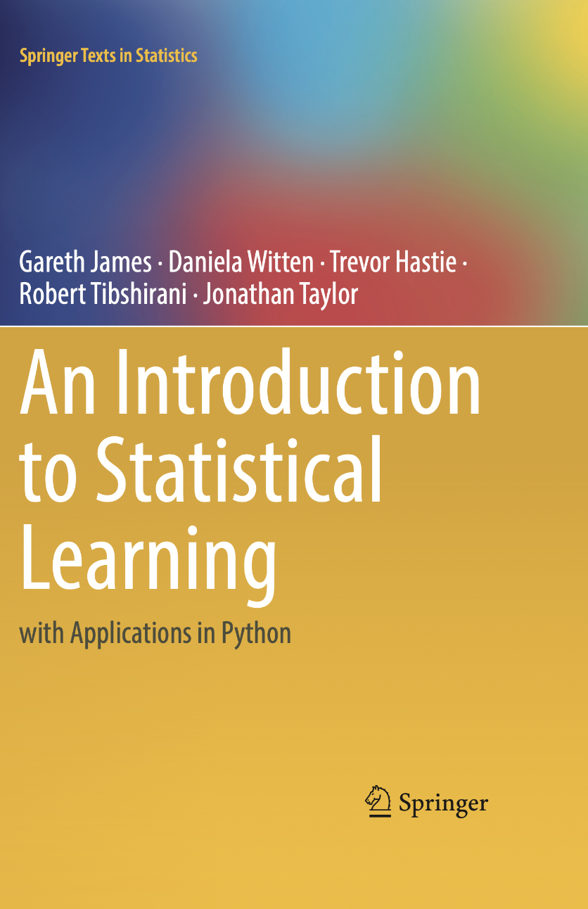

##### An Introduction to Statistical Learning

Statistical learning has become a critical toolkit for anyone who wishes to understand data. This book provides a broad and less technical treatment of key topics in…

Gareth James, Daniela Witten, Trevor Hastie, Robert Tibshirani, Jonathan Taylor

Jul 5, 2023

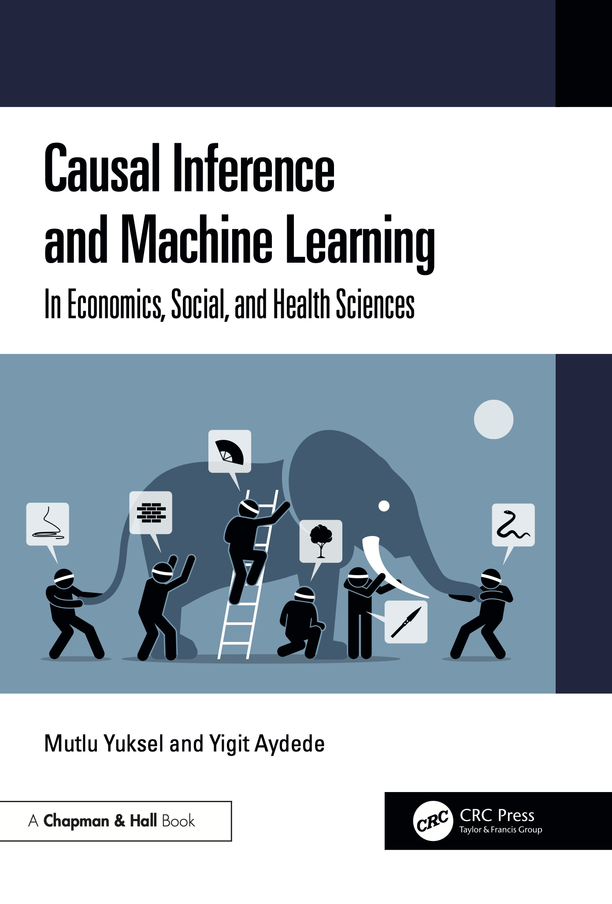

##### Causal Inference and Machine Learning

We wrote this book to fill a real gap: a single, coherent guide that connects econometrics, causal methods grounded in the counterfactual framework, and modern machine…

Mutlu Yuksel, Yigit Aydede

Jan 1, 2026

##### Causal Inference: What If

A book that helps scientists—especially health and social scientists—generate and analyze data to make causal inferences that are explicit about both the causal question and…

Miguel A. Hernán, James M. Robins

Jan 2, 2024

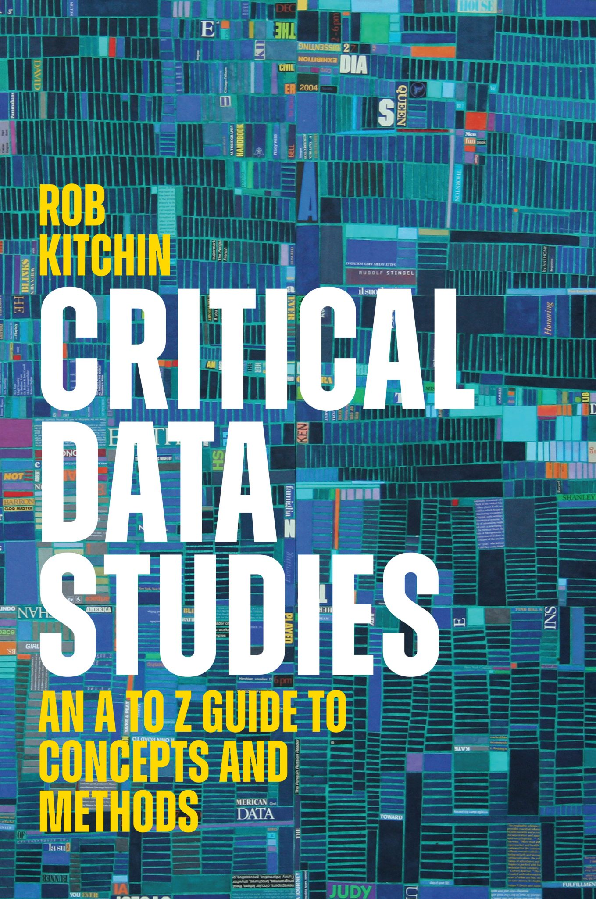

##### Critical Data Studies

This book provides a glossary for the field, consisting of 413 entries about key terms. Each entry sets out a definition, a descriptive overview, and further reading. The…

Rob Kitchin

Jan 6, 2025

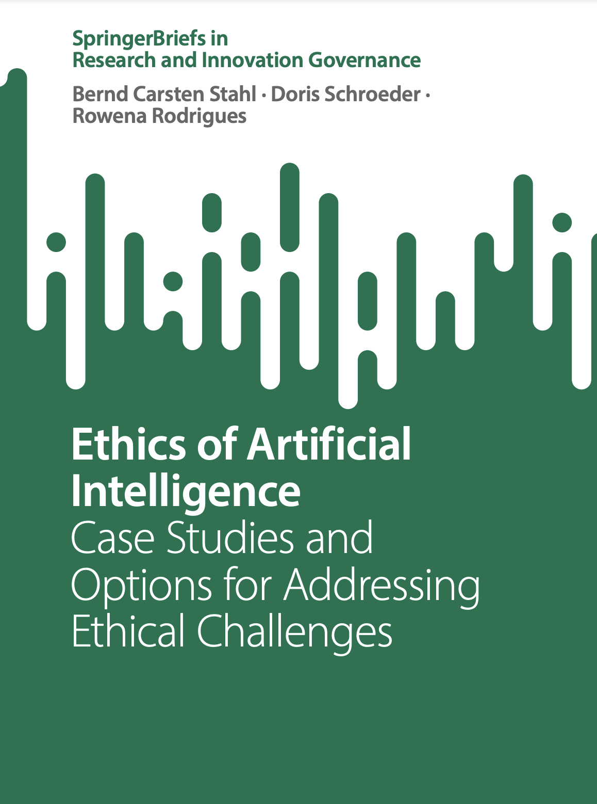

##### Ethics of Artificial Intelligence

This open access collection of AI ethics case studies is the first book to present real-life case studies combined with commentaries and strategies for overcoming ethical…

Bernd Carsten Stahl, Doris Schroeder, Rowena Rodrigues

Jan 1, 2023

##### Fairness and Machine Learning

Many take the leap of faith behind statistical decision making for granted to an extent that it’s become difficult to question. In this book, we take machine learning as a…

Solon Barocas, Moritz Hardt,, Arvind Narayanan

Jan 1, 2023

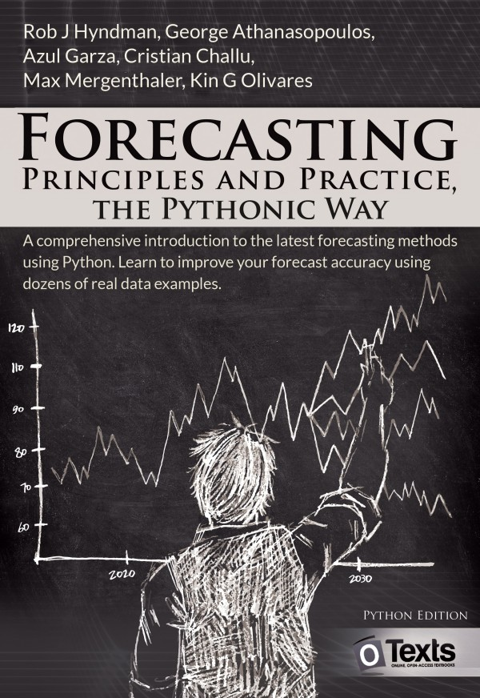

##### Forecasting Principles & Practice the Pythonic Way

This textbook is provides a comprehensive introduction to forecasting methods and presents enough information about each method for readers to be able to use them sensibly.…

Rob J Hyndman, George Athanasopoulos, Azul Garza, Cristian Challu, Max Mergenthaler, Kin G. Olivares

Jun 18, 2025

##### Fundamentals of Data Visualization

The book is meant as a guide to making visualizations that accurately reflect the data, tell a story, and look professional.

Claus O. Wilke

Aug 20, 2020

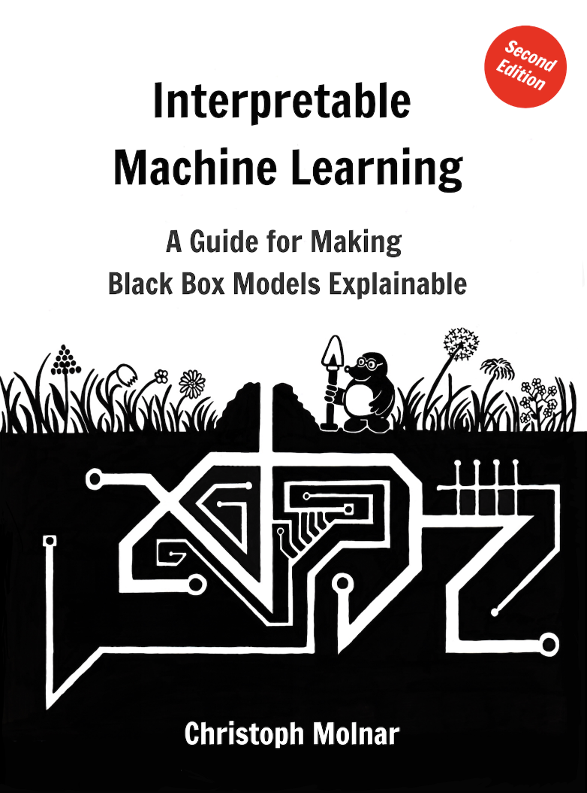

##### Interpretable Machine Learning

This book is about making machine learning models and their decisions interpretable. It will enable you to select and correctly apply the interpretation method that is most…

Christoph Molnar

Mar 4, 2022

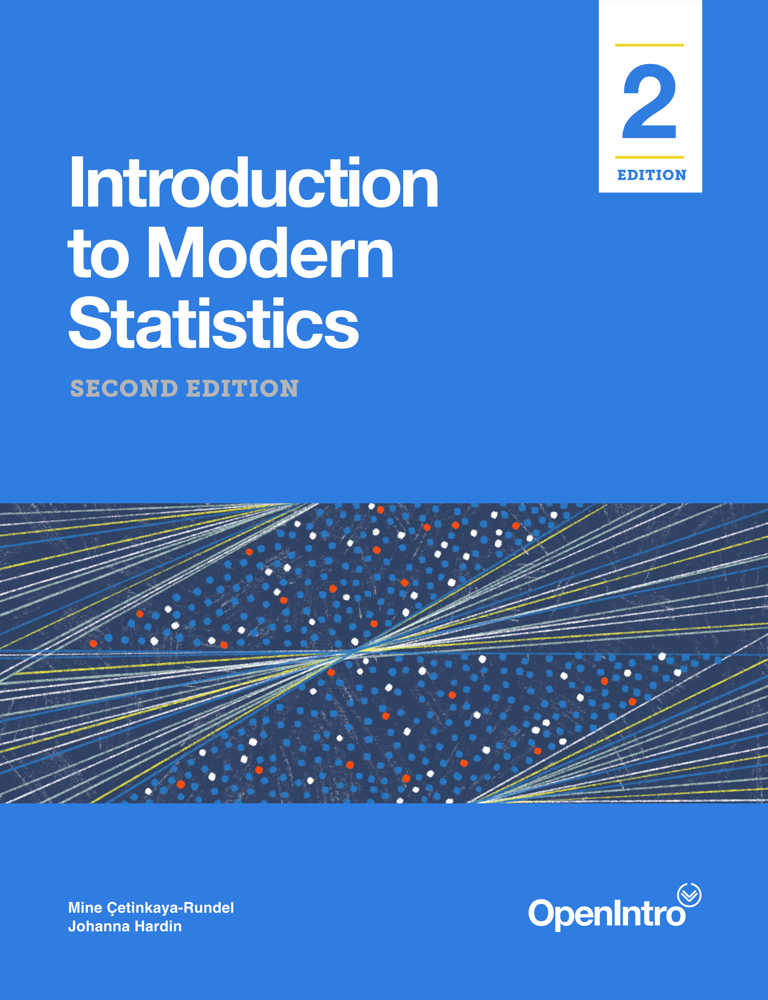

##### Introduction to Modern Statistics (2nd edition)

This books aims to offer three ideas, namely i) statistics is an applied field with a wide range of practical applications; ii) you don’t have to be a math guru to learn…

Mine Çetinkaya-Rundel, Johanna Hardin

Jan 1, 2024

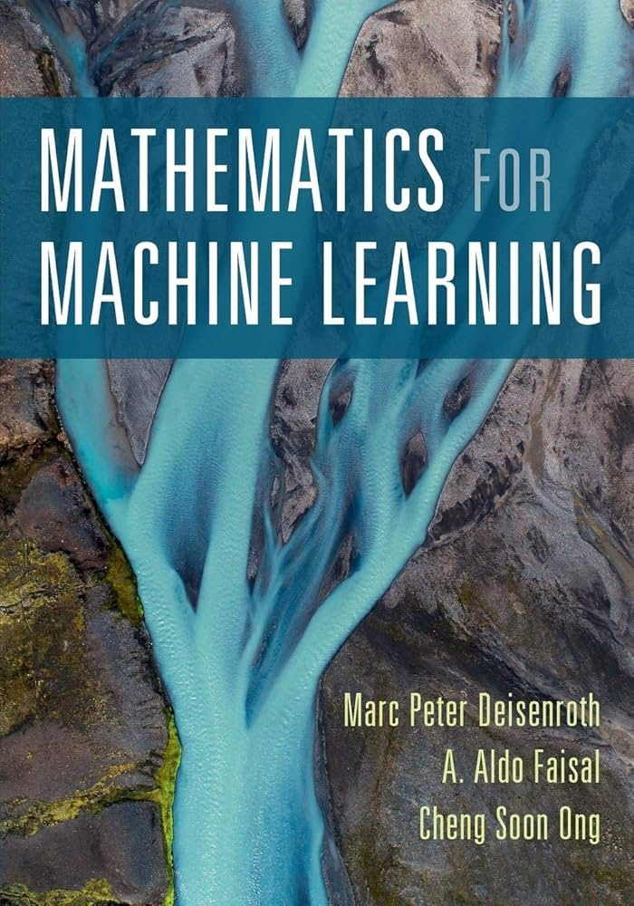

##### Mathematics For Machine Learning

This book aims to motivate people to learn mathematical concepts. The book is not intended to cover advanced machine learning techniques because there are already plenty of…

Marc Peter Deisenroth, A. Aldo Faisal, Cheng Soon Ong

Jan 15, 2024

##### Python of Data Analysis, Third Edition

This book is concerned with the nuts and bolts of manipulating, processing, cleaning, and crunching data in Python.

Wes McKinney

Apr 12, 2023

##### R for Data Science, Second Edition

This book will teach you how to do data science with R: You’ll learn how to get your data into R, get it into the most useful structure, transform it and visualize.

Hadley Wickham, Mine Çetinkaya-Rundel, Garrett Grolemenund

Nov 30, 2023

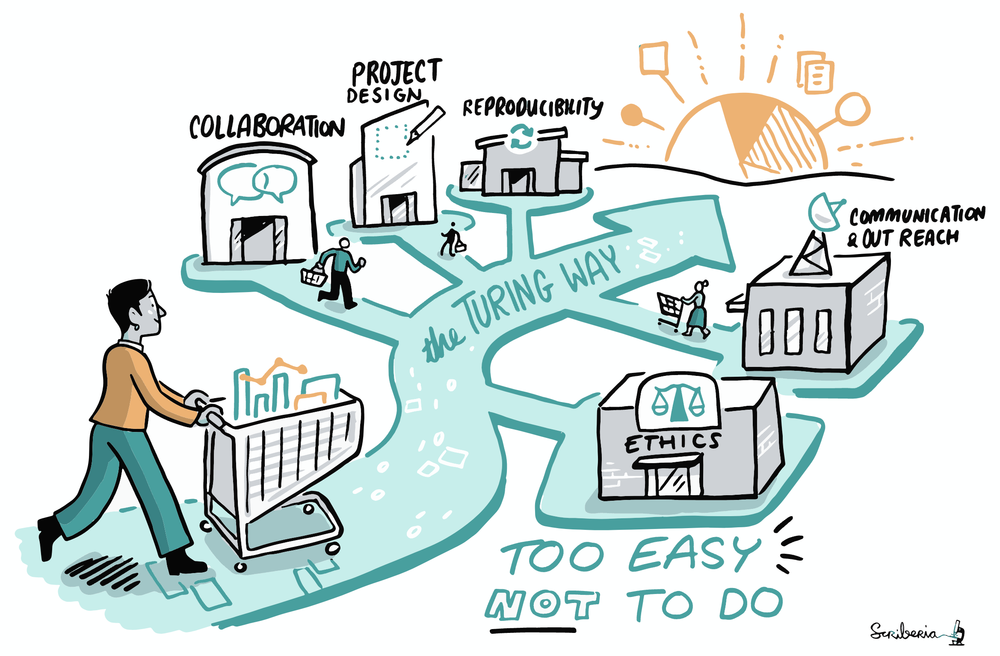

##### The Turing Way

An open source, open collaboration, community-driven handbook to reproducible, ethical and collaborative data science.

The Turing Way Community

Jul 22, 2022

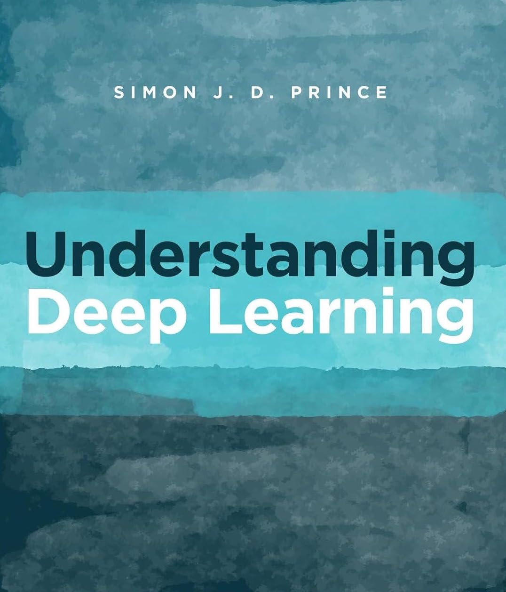

##### Understanding Deep Learning

This book explains the ideas that underlie deep learning, distinguishing it from volumes that cover coding and other practical aspects. More resources can be found on \<a…

Simon Prince

Oct 23, 2023

## Non-open access books

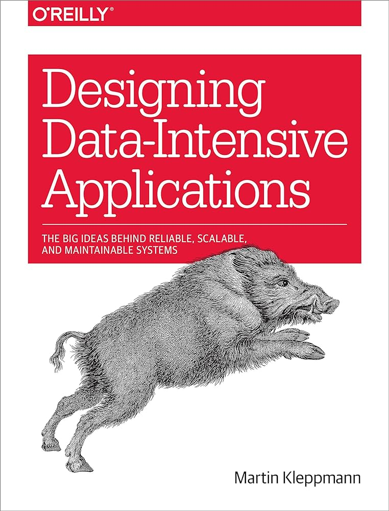

##### Designing Data-Intensive Applications

Data is at the center of many challenges in system design today. Difficult issues need to be figured out, such as scalability, consistency, reliability, efficiency, and…

Martin Kleppmann

Mar 1, 2017

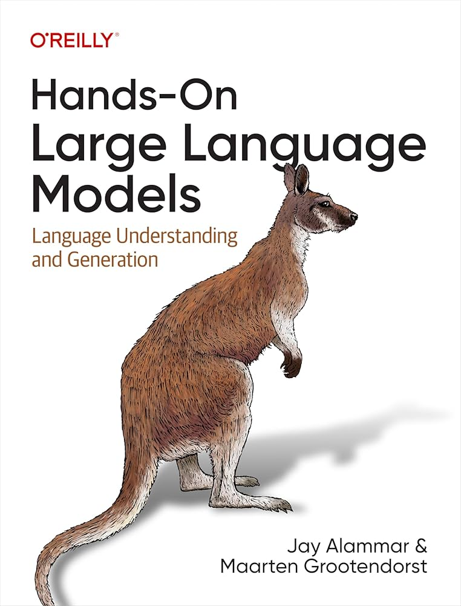

##### Hands-On Large Language Models

AI has acquired startling new language capabilities in just the past few years. Driven by rapid advances in deep learning, language AI systems are able to write and…

Jay Alammar, Maarten Grootendorst

Sep 1, 2024

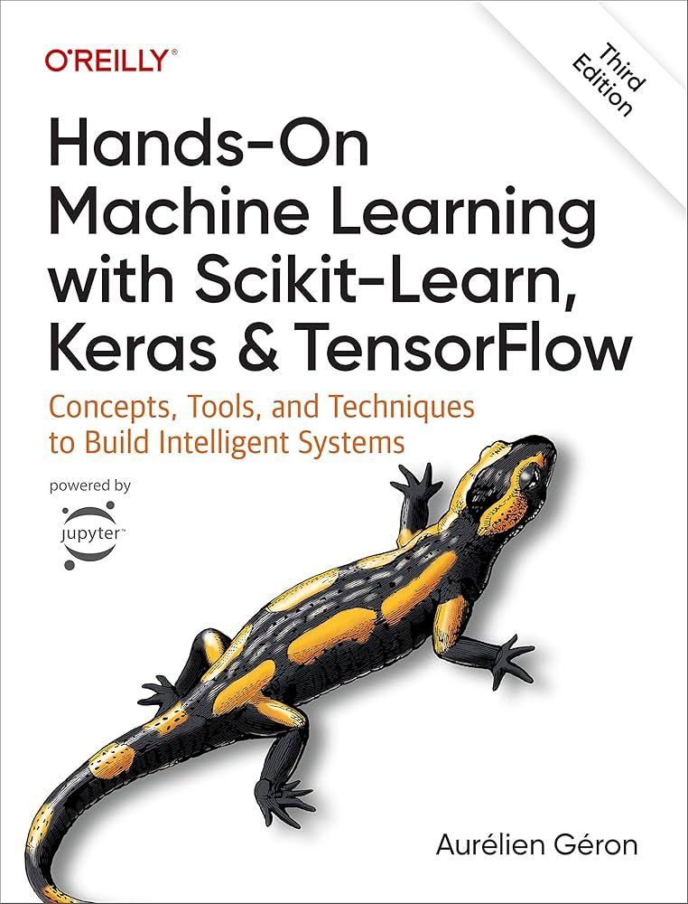

##### Hands-On Machine Learning with Scikit-Learn, Keras, and TensorFlow, 3rd Edition

Through a recent series of breakthroughs, deep learning has boosted the entire field of machine learning. Now, even programmers who know close to nothing about this…

Aurélien Géron

Oct 1, 2022

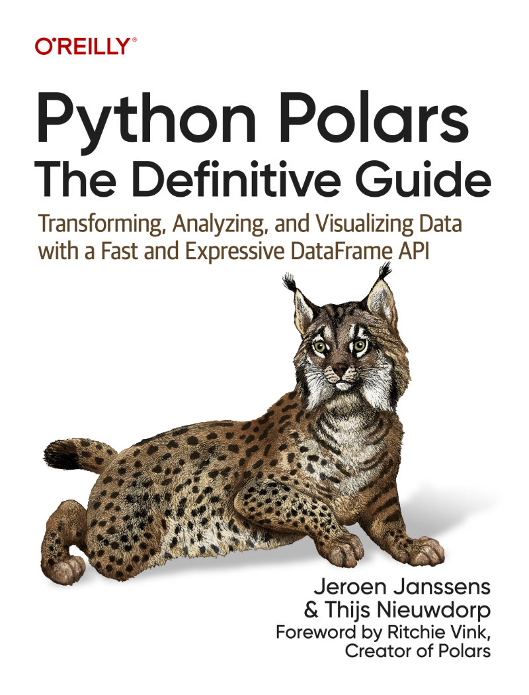

##### Python Polars: The Definitive Guide

This book is designed for anyone looking to leverage the power of Polars in Python to transform, analyze, and visualize data more efficiently and effectively. I completely…

Jeroen Janssens, Thijs Nieuwdorp

Feb 1, 2025
