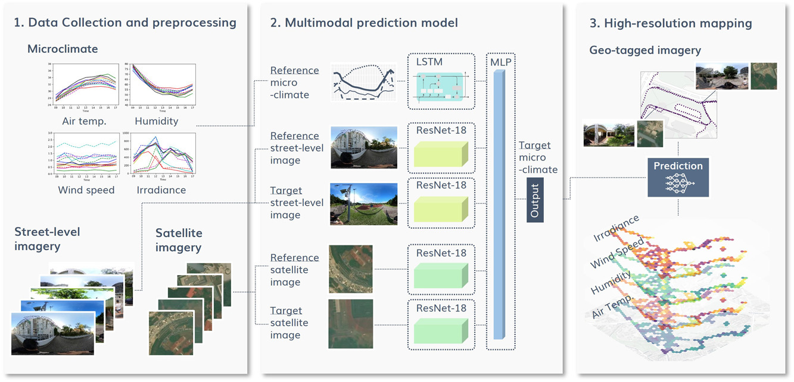
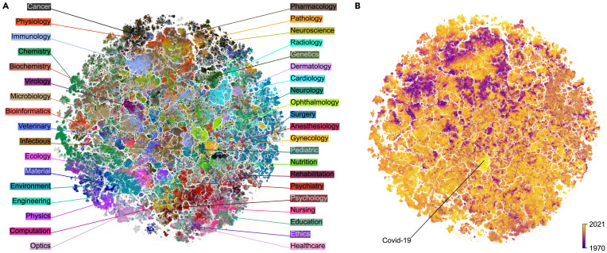
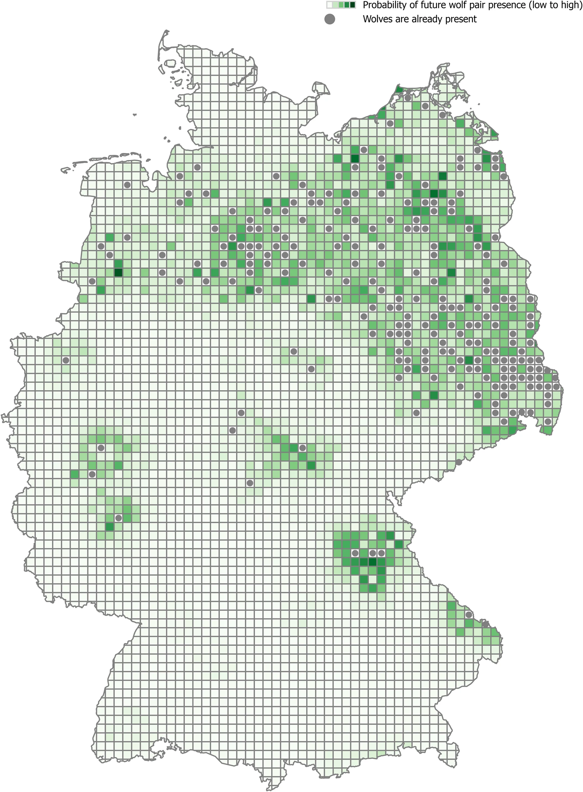
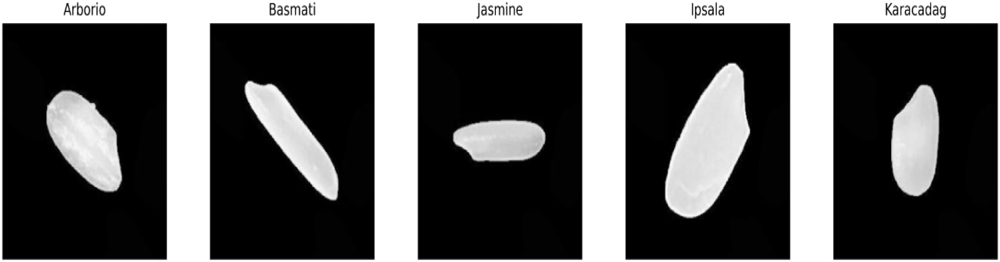
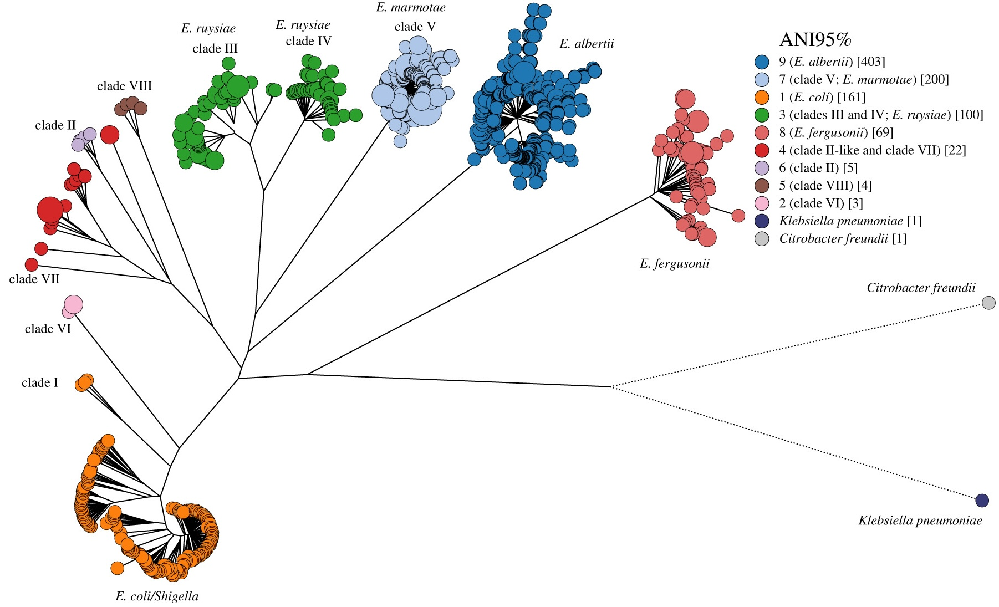
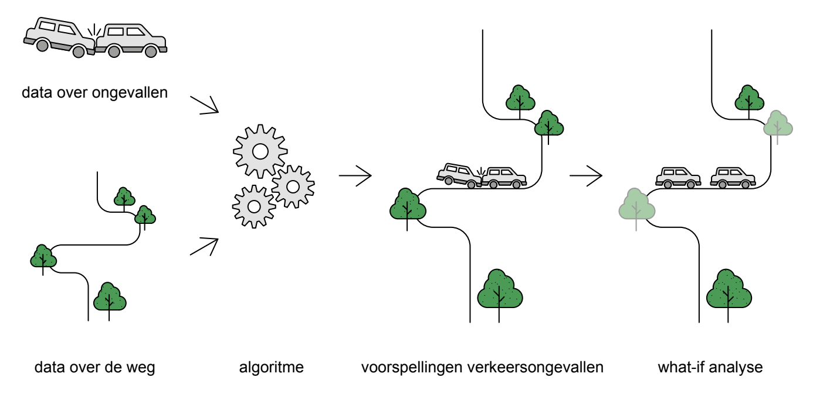

# Selected use cases & applications

##### Multimodal prediction of climatic parameters using street-level and satellite imagery

High-resolution microclimate data is essential for capturing spatio-temporal heterogeneity of urban climate and heat health management. However, previous studies have relied…

Kunihiko Fujiwara et al.

Aug 20, 2024

##### The landscape of biomedical research

Over 1.5 million scientific articles on biomedicine and life sciences are now published and collected in the PubMed database every year. This vast scale makes it challenging…

Rita González-Márquez et al.

Jun 14, 2024

##### Predict precence of wolf pairs in Germany with XGBoost and SHAP

Wolves have returned to Germany since 2000. Numbers have grown to 209 territorial pairs in 2021. XGBoost machine learning, combined with SHAP analysis is applied to predict…

Jeanine Schoonemann et al.

Feb 19, 2024

##### Classifying rice grains using deep learning

Rice, one of the world’s most significant agricultural products, is crucial for human nutrition, economies, and various industrial sectors. Classifying rice varieties, an…

Farshad Farahnakian et al.

Nov 28, 2023

##### Inzicht in energiearmoede

In januari 2022 zijn energieprijzen met 86% gestegen ten opzichte van het jaar daarvoor. Met de oorlog in Oekraïne en de inflatie zijn de prijzen alleen nog maar hoger…

Anouk Fredriksz

Feb 1, 2023

##### EnteroBase - hierarchical clustering of 100 000s of bacterial genomes into species/subspecies and populations

The Linnean system of species designation was applied in the the late 19th century to bacteria. Initially, bacteria have been been classified based on their disease…

Mark Achtman et al.

Aug 22, 2022

##### Verkeersveiligheidmodel

In het Verkeersveiligheidsmodel koppelen we data over historische ongevallen aan gegevens over de weg, over het verkeer en over de omgeving binnen de invloedsfeer van de…

Arjan Knol

Aug 1, 2019
