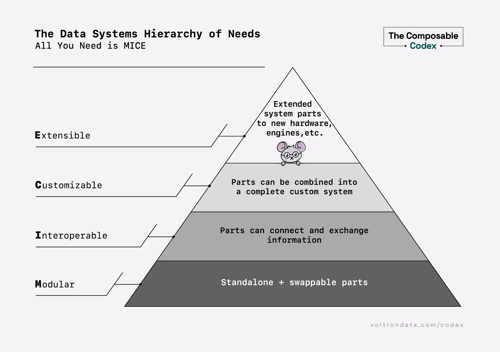
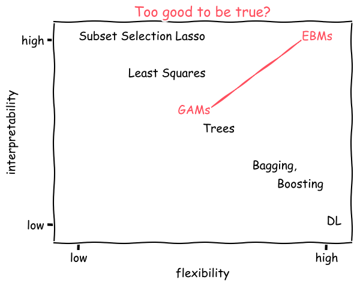
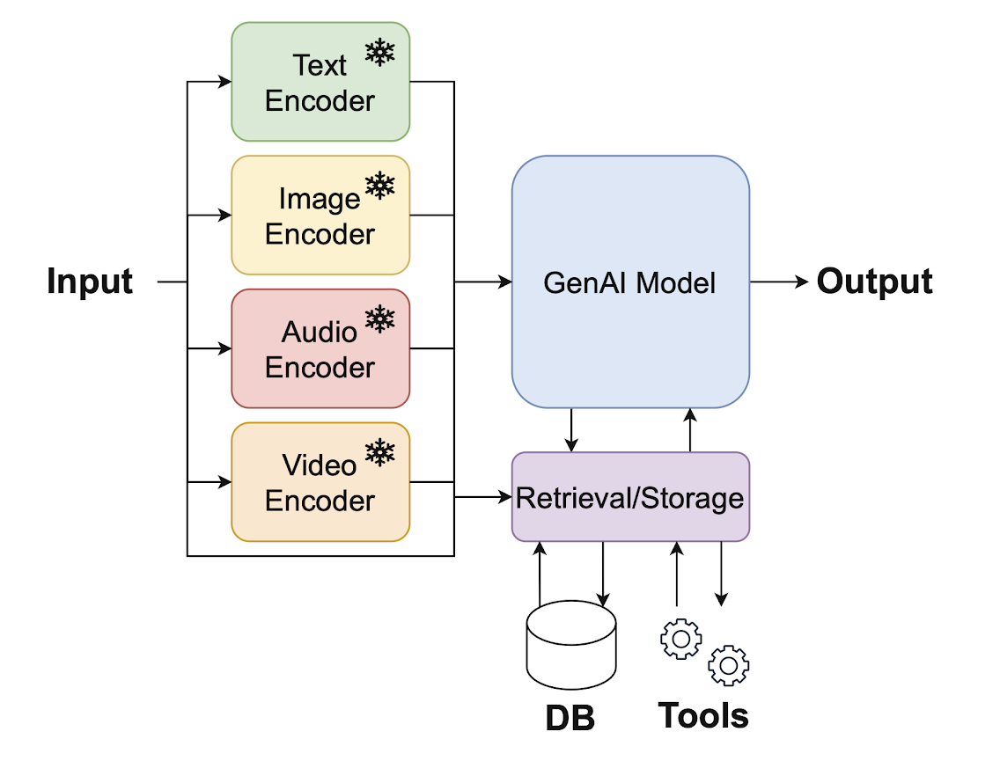
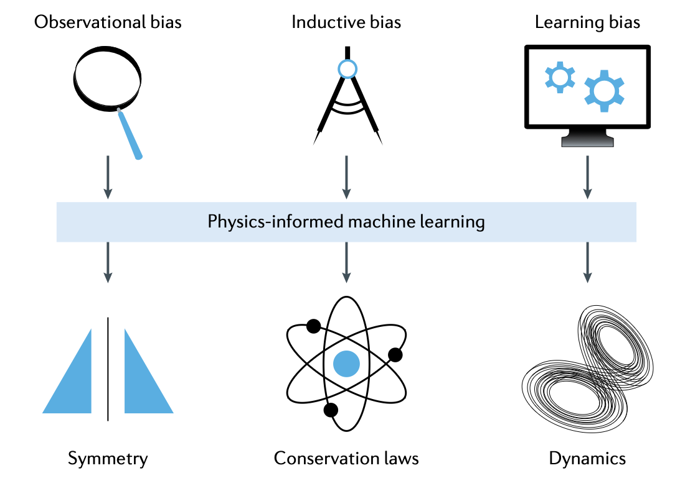
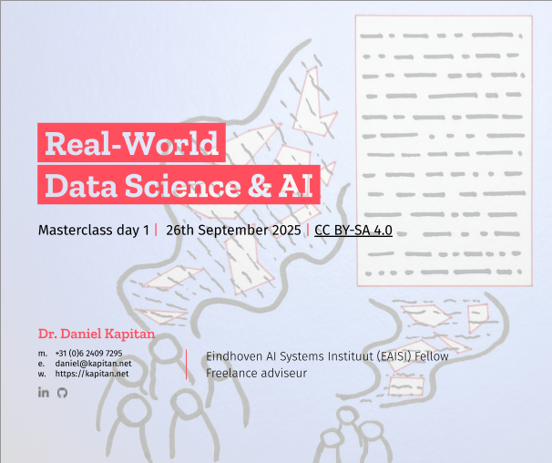

##### Composable data platforms

Slides from a 3-hour guest lecture given at Strathmore University.

Daniel Kapitan

Jul 2, 2024

##### Engineering data science & AI platforms

Slides for a full-day lecture

Daniel Kapitan

Apr 17, 2026

##### Explainable Boosting Machines

Slides from a 1-hour workshop, after which you will be convinced that EBMs are your standard go-to algorithm for tabular data.

Daniel Kapitan

Sep 9, 2024

##### Generative AI

Introduction to generative AI and agentic systems in a 4-hour lecture

Daniel Kapitan

Dec 5, 2024

##### Physics-informed machine learning

Introduction to physics-informed machine learning in a 1-hour lecture.

Daniel Kapitan

Aug 23, 2023

##### Real World Data Science

Slidedeck for a 2-day masterclass. While it is probably difficult to follow without the voice-over, the many references included in the slides are useful for a bird’s eye…

Daniel Kapitan

Sep 26, 2025
