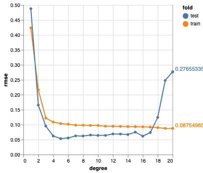
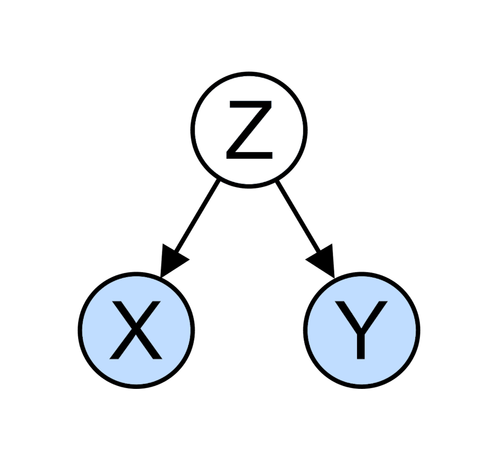

# Notebooks and explainers with code

##### Demonstration of overfitting and underfitting

This notebook illustrates why we require a train/test split (or cross-validation) to balance overfitting vs. underfitting.

May 1, 2023

##### Deconfounding explained

A demonstration howcorrelations ‘magically’ disappear if confounders are added to your model.

Sep 18, 2022
