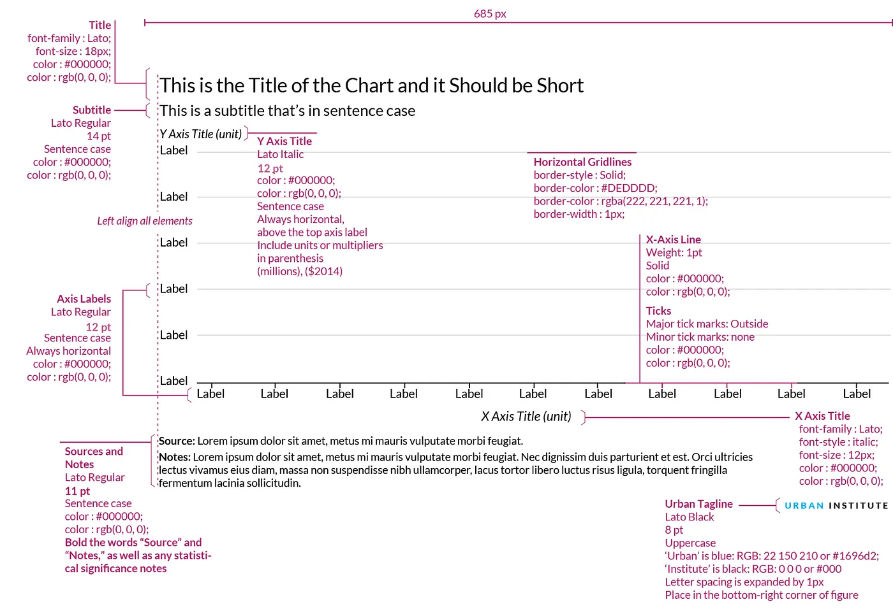
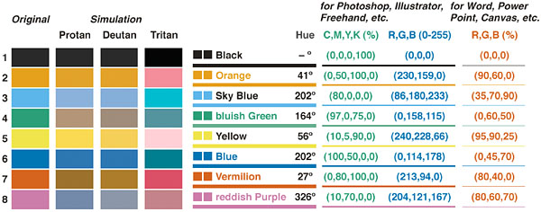

# Amazing Altair with an even better theme

english

visualization

coding

Implementing best practices for data visualization as an Altair theme.

Author

Daniel Kapitan

Published

January 21, 2024

I have been in love with Altair ever since I first ran into it. The logic, the structure, the syntax: it’s all just there and it helps me to get my work done. Paired with [Quarto](https://quarto.org) or [Streamlit](https://streamlit.io), I can create stunning pdf reports, interactive documents and single-page apps for my clients, all from one codebase. After attending a workshop by my fellow data viz afficianado [Sara Sprinkhuizen](https://www.thedatavisionlab.com/), I wanted to implement her tried-and-tested best practices for charts into an Altair.

In this post, we will illustate how these improvements work for a handful of visualizations that are often used for exploratory data analysis. We will implement her design principles in an Altair theme, such that we can consistently generate better charts in our workflow. Let’s start and see how Altair’s default theme renders a scatterplot, bar chart and line chart.

Code

``` python
import altair as alt

# import ibis
import polars as pl
from vega_datasets import data


# ibis.options.interactive = True

penguins = pl.read_csv("penguins.csv")
stocks = data.stocks()
wheat = data.wheat()
```

## Scatterplot

A scatterplot is one of the most commonly used visualizations. In this case we encode three values for the [Palmer penguins data](https://allisonhorst.github.io/palmerpenguins/): bill length vs. bill depth, per species. The only optimization we apply is to have the axis not go all the way to zero, so the chart is focused on the actual datapoints.

Code

``` python
scatterplot = (
    alt.Chart(penguins)
    .mark_circle(size=60)
    .encode(
        x=alt.X("bill_length_mm:Q", scale=alt.Scale(zero=False)),
        y=alt.Y("bill_depth_mm:Q", scale=alt.Scale(zero=False)),
        color=alt.Color("species"),
        tooltip=["species", "sex", "island", "bill_length_mm:Q", "bill_depth_mm:Q"],
    )
)
scatterplot
```

## Bar chart

Next up is the trusty ol’ bar chart, which we demonstrate using the wheat dataset. This chart is challenging because it spans two and a half centuries of yearly data, leading to a wide chart with the default settings. Did you turn your head to read the year labels on the x-axis? Or to figure out that the y-axis title reads `wheat`? Surely there must be a better way.

Code

``` python
barchart = (
    alt.Chart(wheat)
    .mark_bar()
    .encode(x="year:O", y="wheat:Q", tooltip=["year:O", "wheat:Q"])
)
barchart
```

## Line chart

A line chart with a legend, in this case showing stock prices of a handful of tech companies, is also something we use on a regular basis. Did you even notice the effort you have to put in to lookup the color of the line in the legend? I actually had a hard time distinguishing Amazon and Google, as the red and orange are very alike to my eyes.

Code

``` python
chart = alt.Chart(stocks).encode(color=alt.Color("symbol"))
line = chart.mark_line().encode(
    x=alt.X("date:T", axis=alt.Axis(title="date")),
    y=alt.Y("price:Q", axis=alt.Axis(title="price")),
    tooltip=["date", "price"],
)
line
```

## Some simple but sensible design principles

Sara’s main points for improving the standard layout of charts basically boil down to the following princples:

- **use informative action titles and subtitles**: much like effective presentations, using so-called [action titles](https://slideworks.io/resources/how-to-write-action-titles-like-mckinsey) will greatly increase the impact of your data visualization. Formulated as a short, simple sentence, action titles should ideally be the main takeaway or ‘so what’ of the chart, and – if done right – allows the audience to only read the title to understand the primary message of the visual.
- **less is more**: before minimalism became all the rage in design, Edward Tufte coined the principle of [maximizing the data-to-ink ratio](https://infovis-wiki.net/wiki/Data-Ink_Ratio). Charts are easier to read by removing unnecessary clutter. So get rid of gridlines, background colors and the like.
- **keep it horizontal**: text is easier to read when it is horizontally aligned. So straighten up those rotated x-axis labels and y-axis titles
- **lose the legends**: having to lookup colors increases the cognitive load of reading a chart. Use annotations instead.

All these principles can be readily implemented in Altair. Sergio Sánchez in fact captured the first three principles when implementing the Urban Institute styleguide (shown below) as [an Altair theme](https://towardsdatascience.com/consistently-beautiful-visualizations-with-altair-themes-c7f9f889602).

[](images/urban-institute-styleguide.webp)

Building on his work, we created our own theme called **Okabe Ito**, in honour of their work in defining [colorblind-safe color palettes](https://thenode.biologists.com/data-visualization-with-flying-colors/research/). Not only is it functional, but I really like the muted colors, too. Below is a visual from their [original paper](https://jfly.uni-koeln.de/color/) that also shows how different types of colorblindness (protan, deutan, tritan) results in different perception of the colors.

[](images/otabe-ito-pallete.jpg)

To use this template, download [okabe-ito-theme.py](../../resources/okabe-ito-theme.py), put it in the same folder as your notebook and add the following two cells.

To register the template as an Altair theme:

Code

``` python
%run ../../resources/okabe-ito-theme.py
```

To download the fonts used in the template:

Code

``` python
%%html
<style>
@import url('https://fonts.googleapis.com/css?family=Lato');
</style>
```

Let’s see how this changes the charts.

### Adding titles

The theme automatically has been configured to improve the data-to-ink ratio and align all texts horizontally. Adding action titles can be done using [`alt.TitleParams`](https://altair-viz.github.io/user_guide/customization.html#adjusting-the-title), with which you can not only add a title, but also add multiple subtitles lines which you pass as a list.

Code

``` python
(
    scatterplot.properties(
        title=alt.TitleParams(
            "Bill length vs. bill depth", subtitle=["Did you spot Simpson's Paradox?"]
        )
    )
)
```

### Everything horizontal

The effect of aligning all text horizontally is a significant improvement on the bar chart, which is now much easier to read. Adding a two-line subtitle make the action title even more compelling. Using `alt.mark_text()` we can easily add footnotes as well, in this case to provide references to the claim.

Code

``` python
footnote = alt.Chart(wheat).mark_text(
    text="*Source: https://en.wikipedia.org/wiki/British_Agricultural_Revolution",
    color="#000000",
    x=0,
    y="height",
    dy=60,
    align="left",
)

alt.layer(barchart, footnote).properties(
    title=alt.TitleParams(
        "What's Up With Wheat",
        subtitle=[
            "An example of the impact of the agricultural revolution",
            "Productivity increased through mechanization*",
        ],
    ),
)
```

### Lose the legends

Although legends are fine for exploratory data analysis, where you don’t want to spend too much time tweaking your charts, for explanatory data analysis we want to make it as easy on the reader as possible. Unforunately, I couldn’t find a way to add annotations (instead of a legend) using Altair’s theming engine. Here’s a first shot by implementing it manually.

``` python
chart = alt.Chart(stocks).encode(color=alt.Color("symbol", legend=None))
line = chart.mark_line().encode(
    x=alt.X("date:T", axis=alt.Axis(title="date")),
    y=alt.Y("price:Q", axis=alt.Axis(title="price")),
    tooltip=["date", "price"],
)
label = chart.encode(
    x=alt.X("date:T", aggregate="max"),
    y=alt.Y("price:Q", aggregate={"argmax": "date"}),
    text="symbol",
)
text = label.mark_text(align="left", dx=4)
circle = label.mark_circle()
(
    (line + circle + text).configure_axisX(labelAngle=0, ticks=False)
    # .configure_axisY(titleAngle=0, titleAlign="center", titleX=-10, titleY=-10)
).properties(
    width=600,
    title=alt.TitleParams(
        "The Rise of Google",
        subtitle=[
            "Google went public in 2004",
            "and outperformed other tech stocks until 2010",
        ],
    ),
)
```

I could go on for hours, tweaking this and that. For example, the labels in the last chart overlap. Vega has the [label transform](https://vega.github.io/vega/docs/transforms/label/) method to deal with that, but that implementation still needs to cascade down to Vega-Lite and Altair. Someday, I will package all this as a proper theme, re-using [feedzai’s](https://github.com/feedzai/feedzai-altair-theme) code.
