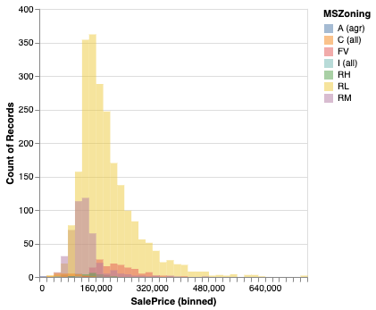
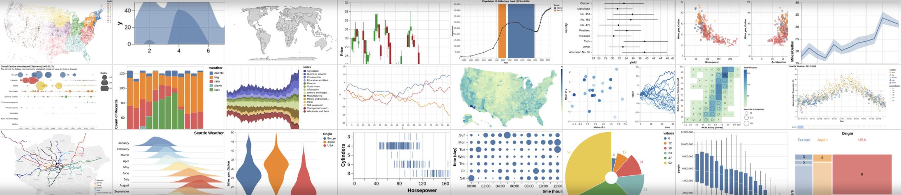
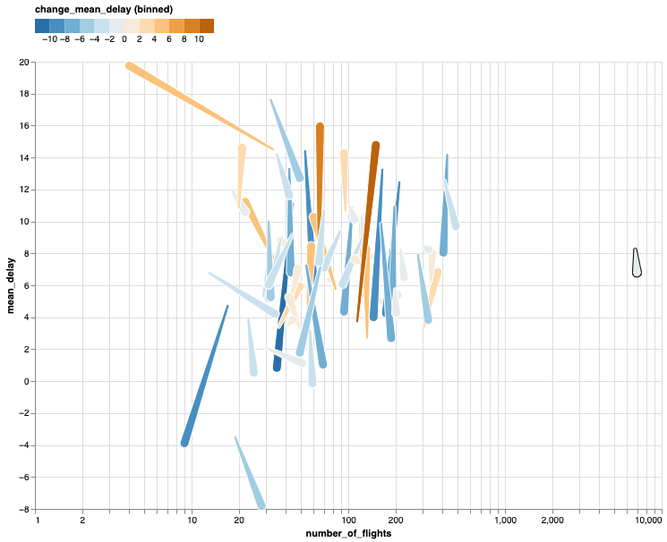
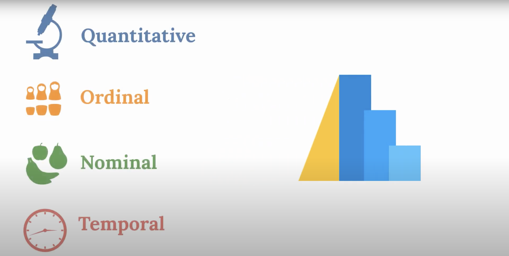
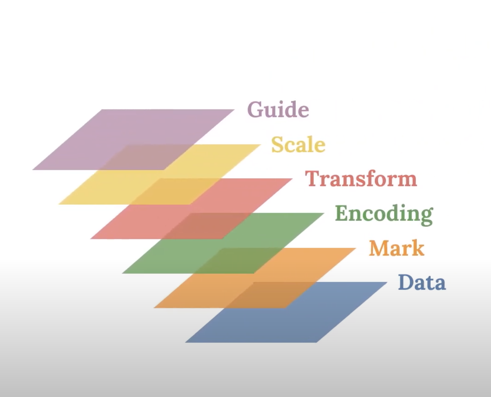
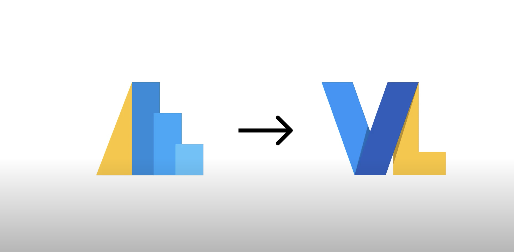

# Data visualization with Vega-Altair

I am a big fan of the Vega-Altair ecosystem for data visualization, because it not only helps me in creating appealing, interactive visualizations, but it also helps me to reason about the data when I am doing exploratory data analysis.

Author

Daniel Kapitan

Published

December 21, 2023

## 

##### Amazing Altair with an even better theme

Implementing best practices for data visualization as an Altair theme.

Daniel Kapitan

Jan 21, 2024

##### Exploratory data analysis with Altair

This notebook collects explorations of Altair’s most interesting features. Originally published on \<a…

[Jacopo Repossi](https://www.linkedin.com/in/jacopo-repossi/)

Jan 1, 2023

##### Visualization curriculum with Altair

A data visualization curriculum of interactive notebooks, using Vega-Lite and Altair.

Jeffrey Heer, Dominik Moritz, Jake VanderPlas, Brock Craft

Mar 25, 2021

##### Comet charts in Python

Visualizing statistical mix effects and Simpson’s paradox with Altair

Daniel Kapitan

Jan 29, 2021

##### Altair’s data types

Understanding your data is critical in creating visualizations. This video outlines Altair’s data types and explains how they can influence the visualization process.

Eitan Lees

Aug 23, 2020

##### Altair’s visualization grammar

This video outlines the visualization grammar Altair is built on. Understanding the ways in which the elements of the visualization grammar interact is important when using…

Eitan Lees

Aug 13, 2020

##### What is Altair?

This video describes the Python package Altair and the software stack it is built on.

Eitan Lees

Aug 4, 2020
