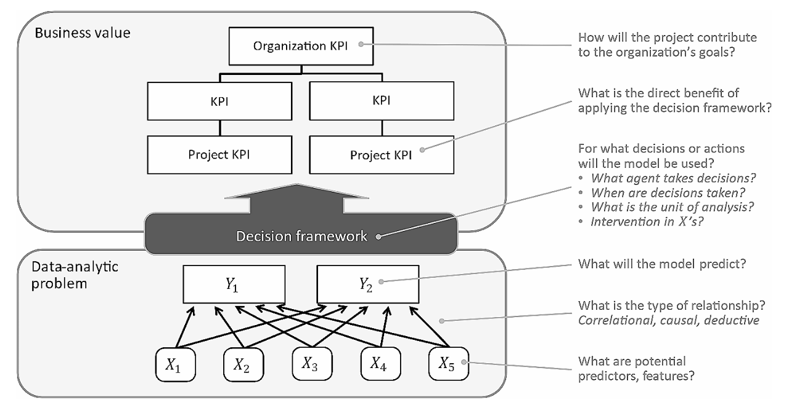
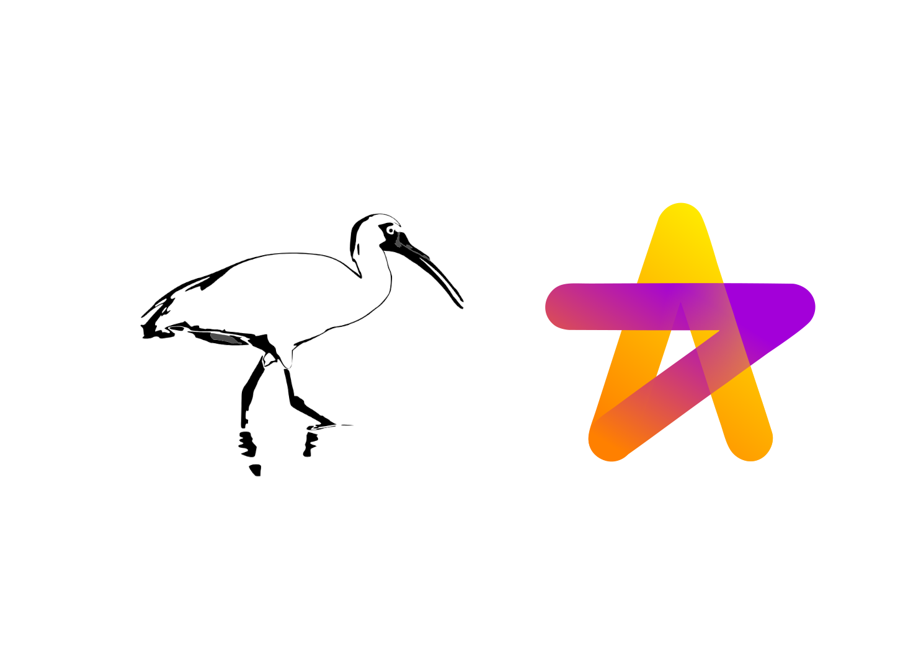
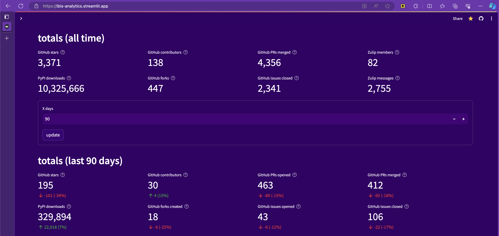
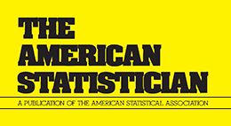

# Perspectives on data science

##### DAPS - Data-Analytic Problem Structure

Models for structuring big-data and data-analytics projects typically start with a definition of the project’s goals and the business value they are expected to create. The…

Jeroen de Mast, Joran Lokkerbol

Apr 12, 2024

##### The Design Philosophy of Great Tables

Rich Iannone and Michael Chow

Apr 4, 2024

##### Portable dataflows with Ibis and Hamilton

Thierry Jean

Apr 2, 2024

##### Modern, hybrid, open analytics

Cody Peterson

Jan 25, 2024

##### Data visualization with Vega-Altair

I am a big fan of the Vega-Altair ecosystem for data visualization, because it not only helps me in creating appealing, interactive visualizations, but it also helps me to…

Daniel Kapitan

Dec 21, 2023

##### Getting into Python

How to get into Python, the most widely used programming language for data science.

Daniel Kapitan

Dec 21, 2023

##### Analytical problem solving

I co-authored a peer-reviewed paper that compares the different modeling approaches for analytical problem solving.

Daniel Kapitan, Jeroen de Mast, Stefan Steiner, Wim Nuijten

Mar 10, 2022

##### Stop aggregating away the signal in your data

By aggregating our data in an effort to simplify it, we lose the signal and the context we need to make sense of what we’re seeing. Originally published on \<a…

Zan Armstrong

Mar 3, 2022

##### RIP correlation. Introducing the Predictive Power Score.

We define the Predictive Power Score (PPS), an alternative to the correlation that finds more patterns in your data. Originally published on \<a…

Florian Wetschoreck

Apr 23, 2020

##### The Precision-Recall Plot Is More Informative than the ROC Plot

An introduction to performance metrics for binary classification. Originally published on \<a…

Paul van der Laken, Daniel Kapitan

Aug 16, 2019
