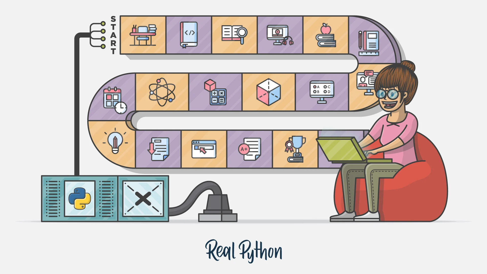

# Getting into Python

How to get into Python, the most widely used programming language for data science.

Author

Daniel Kapitan

Published

December 21, 2023

## Why Python for data science?

Python has emerged over the last couple decades as a first-class tool for scientific computing tasks, including the analysis and visualization of large datasets. This may have come as a surprise to early proponents of the Python language: the language itself was not specifically designed with data analysis or scientific computing in mind. The usefulness of Python for data science stems primarily from the large and active ecosystem of third-party packages, particularly:

- NumPy for manipulation of homogeneous array-based data;
- Pandas for manipulation of heterogeneous and labeled data, and the more recent high-performace dataprocessing libraries such as polars and ibis;
- SciPy for common scientific computing tasks, Matplotlib for publication-quality visualizations;
- IPython for interactive execution and sharing of code;
- Scikit-Learn for machine learning.

## How much Python should I know?

As with any other (programming) language, it takes years to master it fluently which is beyond the scope this anthology. Instead, our objective is to have a working knowledge of Python to be able to learn and apply machine learning. To make this explicit we take the following book and online resources as our point of reference.

- A Whirlwind Tour of Python (pages number from the [pdf version](../../resources/vanderplas2016whirlwind.pdf)):
  - Know how to install and use Python on your own computer (pages 1 to 13)
  - Know basic semantics of variables, objects and operators (pages 13 to 24)
  - Know built-in simple values and data structures (pages 24 to 37)
  - Know how to use control flow and functions (pages 37 to 45)
  - Know how to iterate and use list comprehensions (pages 52 to 61)
- Python for Data Analysis
  - Know how to manipulate data with pandas, with [Python for Data Analysis, Third Edition](../../books/pda.llms.md) as your reference guide

> **NOTE:**
>
> The learning path proposed here is similar to the [PCEP™ – Certified Entry-Level Python Programmer](https://www.pythoninstitute.org/certification/pcpe-certified-entry-level-python-programmer/) certification. The PCEP™ certification is a good way to assess your current Python knowledge and to prepare for the Machine Learning Foundation course. The certification is offered by the [Python Institute](https://www.pythoninstitute.org/). You may opt to obtain this certificate.

## How should I learn Python?

RealPython.com is the recommended online learning environment for Python. We have collated a [learning path for data science](../../posts/python/realpython.llms.md).

## Which Python environment should I use?

Options how to start using Python are listed below.

## Online notebook (easy)

For those new to Python, it is probably easiest to start with one of these online notebook environments:

- [Deepnote](https://deepnote.com/): there is a generous free-tier. If you decide to upgrade, you can collaborate and share notebooks privately.
- [Google Colab](https://colab.research.google.com/notebooks/intro.ipynb):
  - Activate a Google account if you haven’t got one yet.
  - Work your way through the [Colab introduction notebook](https://colab.research.google.com/notebooks/intro.ipynb).

Once you have gained some traction, you can move on to install Python on your local machine.

## Visual Studio Code (intermediate)

Visual Studio Code is the recommended data science workbench. To setup your local machine/laptop for data science and machine learning, do the following:

- Follow these two tutorials on RealPython.com:
  - [Installing Python](https://realpython.com/installing-python/)
  - [Python in VS Code](https://realpython.com/python-development-visual-studio-code/)
- For more advanced use, including using VS Code in the cloud:
  - Read the documentation on [GitHub Codespaces](https://docs.github.com/en/codespaces)
  - Read the documentation on [Azure Dev Containers](https://microsoft.github.io/code-with-engineering-playbook/developer-experience/devcontainers/)
  - Use these excellent [Data Science Dev Containers](https://github.com/b-data/data-science-devcontainers) by [Olivier Benz](https://github.com/benz0li)

## Guidelines for using Python for data science

Using Python for data science is inherently different than using it for, say, building a website. To provide you with some guidance to the many different ways c.q. styles of using Python, please consider the following:

- Focus on using existing data science libraries, instead of writing your own basic functions. If you find yourself spending a lot of time reading documentation, you are on the right track.
- Take a functional approach to programming instead of an object-oriented approach. The former is more fitting for data science, where it is common to structure your work in terms of pipelines and think about each processing step as a function. The latter is more suitable for application development.

For those wanting to further develop their Python skills for data science, the following books are recommended:

- [Python for Data Analysis 3rd Edition](https://wesmckinney.com/book/) by Wes McKinney, the creator of pandas.
- [Data Science With Python Core Skills](https://realpython.com/learning-paths/data-science-python-core-skills/) on Real Python provides an extensive learning path.
- [Hands-On Machine Learning with Scikit-Learn, Keras and Tensorflow (2nd edition)](https://github.com/jads-nl/handson-ml2) by Aurélien Géron. You will need to purchase the book, but the notebooks with example code are [freely available](https://github.com/jads-nl/handson-ml2).
- [Effective Python: 90 Specific Ways to Write Better Python (second edition)](https://effectivepython.com/).

## More on Python

##### Getting into Python with RealPython.com

We have compiled a learning path for those who are new to Python, using a selection of chapters from Real Python.

Daniel Kapitan

Nov 11, 2023

##### Effective Python and idiomatic pandas

Guidelines on how to continue to develop your skills to write effective Python and use pandas in an idiomatic way.

Daniel Kapitan

Sep 18, 2022

##### A Whirlwind Tour of Python

A brief but comprehensive tour of the Python language for those who have (sometimes extensive) backgrounds in computing in some language.

Jake VanderPlas

Aug 10, 2016
